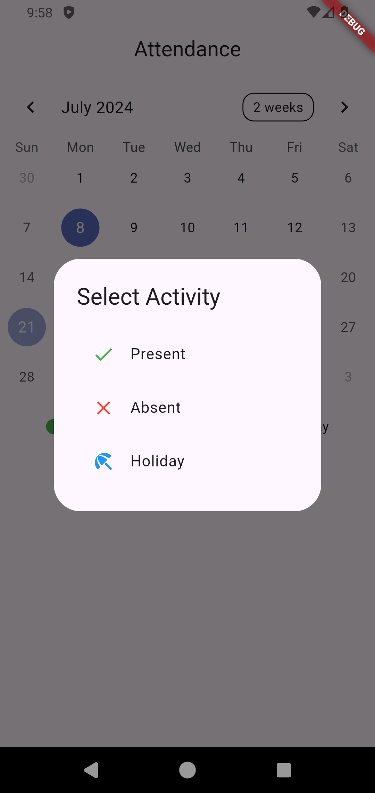
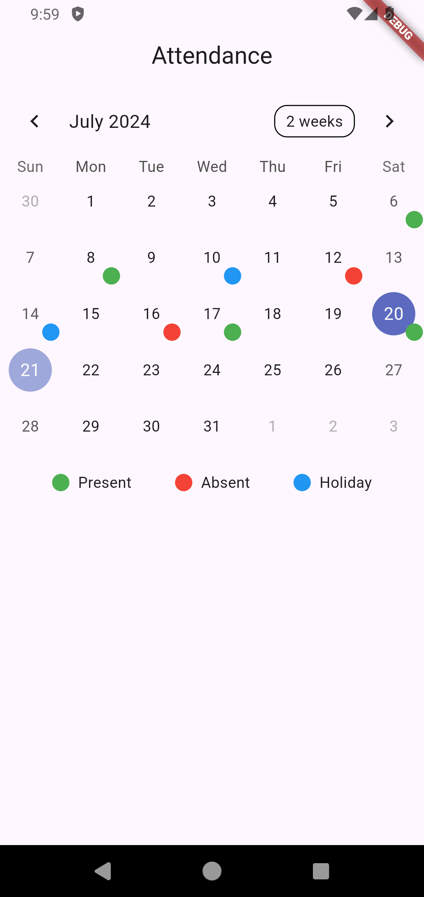

# Attendance Calendar

A simple Flutter application that allows users to mark attendance on a calendar. Users can select a day and mark it as Present, Absent, or Holiday.

## Features

- View a calendar with selectable dates.
- Mark dates with different statuses (Present, Absent, Holiday).
- Visual indicators for each status.
- Legend for quick reference of statuses.

## Screenshots

